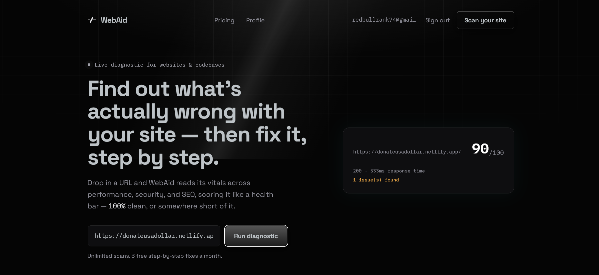
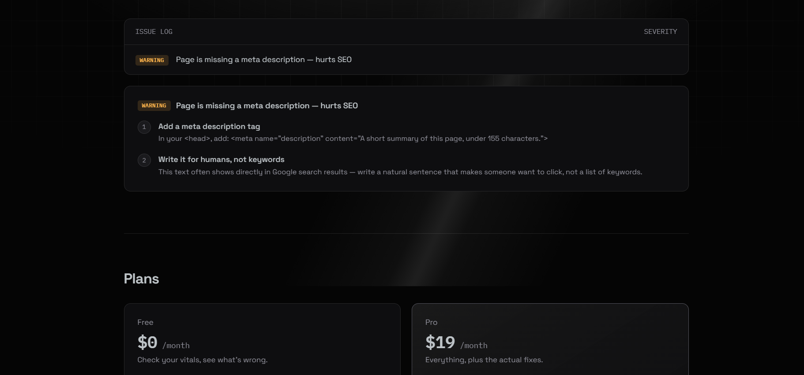

# WebAid

Scan any website and get a health score, a list of what's wrong, and step-by-step instructions for fixing each problem.

**Live site:** https://webaid-production.up.railway.app



## What it does

Paste a URL and WebAid fetches the page, runs a set of checks, and gives the site a score out of 100. Every problem it finds is listed with a severity: critical, warning or minor. Signed-in users can open step-by-step fixes for each problem.

Scans are unlimited. Fixes are the paid part: free accounts get 3 a month, Pro accounts get unlimited.



## What's in it

| Area | Details |
|---|---|
| Scanner | Checks HTTPS, page title, meta description, image alt text, response time and HTTP status. The score starts at 100 and loses points for each problem found. |
| Fixes | Each issue type maps to written fix steps. They come from a fixed rule set, not an AI model. |
| Accounts | Sign up, log in and log out. Passwords are hashed with bcrypt. Sessions use a signed token (JWT) in an httpOnly cookie. Passwords need 8 or more characters with upper case, lower case, a number and a special character. |
| Free and Pro | Free accounts unlock fixes for 3 scans per calendar month. Reopening a scan you already unlocked doesn't use another one. Pro is unlimited. |
| Profile | Shows the plan, fix usage for the month with a progress bar, and recent scans. |
| Admin | Admin accounts are set by email in an environment variable. The admin page lists users with their scan and fix counts and can grant or revoke Pro. |
| Scan history | Private. Each user only sees their own scans. |

## Tech stack

| Layer | Choice |
|---|---|
| Framework | Next.js 16 (App Router, Turbopack) with React and TypeScript |
| Styling | Tailwind CSS v4 |
| Database | SQLite through better-sqlite3 |
| HTML parsing | cheerio |
| Auth | bcryptjs for password hashing, jsonwebtoken for sessions |
| Hosting | Railway, with a persistent volume for the database file |

## How a scan works

1. The browser sends `POST /api/scan` with a URL.
2. The server checks the rate limit, validates the URL, resolves the hostname and refuses private addresses. Redirects are followed one hop at a time and each hop is checked the same way.
3. The page HTML is parsed with cheerio, the checks run, and the score and issues are saved to SQLite.
4. The result goes back to the browser.
5. When the user clicks "See step-by-step fixes", `GET /api/scan/[id]/fix` checks the session, the scan owner, the plan and the monthly usage on the server before returning any steps.

The paywall is enforced on the server. The page only shows what the API allows.

## Security

| Risk | What protects against it |
|---|---|
| Server-side request forgery (SSRF) | Hostnames are resolved and blocked if they point to private, loopback or link-local addresses, including the cloud metadata address. Redirects are checked on every hop. Requests time out after 10 seconds and read at most 2 MB. |
| Brute-force logins | At most 5 attempts per email per 10 minutes. |
| Abuse | Scans are limited to 10 per 10 minutes per IP address, or 30 when signed in. Sign-ups are limited per IP address. |
| Stored passwords | Only bcrypt hashes are stored. |
| Sessions | httpOnly, SameSite=Lax cookie, with the Secure flag in production. |
| Access control | The fix endpoint checks who owns the scan. Admin routes check the admin email on the server and return 403 to everyone else. |
| Secrets | Kept in environment variables and never committed. |

## Run it locally

```bash
git clone https://github.com/v1shalchaudhary/WebAid.git
cd WebAid
npm install
```

Create a `.env` file in the project root:

```
JWT_SECRET=any-long-random-string
ADMIN_EMAILS=you@example.com
```

Then start the dev server and open http://localhost:3000:

```bash
npm run dev
```

The database file `scans.db` is created automatically on the first request.

If `better-sqlite3` fails to load, your npm version may be blocking install scripts. Run `npm install-scripts approve better-sqlite3`, then `npm install` again.

## Environment variables

| Variable | Purpose |
|---|---|
| `JWT_SECRET` | Signs session tokens. Set a long random value in production. |
| `ADMIN_EMAILS` | Comma-separated list of emails that get admin access. |
| `DATABASE_PATH` | Optional. Where the SQLite file lives. Defaults to `scans.db` in the project root. |

## Project structure

```
app/
  api/            auth, scan and admin routes
  admin/          admin page
  profile/        profile page
  page.tsx        home page
components/       Header, Hero, PricingCards, AuthModal and other UI pieces
lib/              database, auth, scanner, fixes, usage, safeFetch, rate limiter
```

## API routes

| Route | What it does |
|---|---|
| `POST /api/scan` | Runs a scan |
| `GET /api/scan` | Returns the signed-in user's recent scans |
| `GET /api/scan/[id]` | Returns one scan |
| `GET /api/scan/[id]/fix` | Returns fix steps. Needs sign-in and counts against the monthly quota. |
| `POST /api/auth/signup` | Creates an account |
| `POST /api/auth/login` | Logs in |
| `POST /api/auth/logout` | Logs out |
| `GET /api/auth/me` | Returns the current user and fix usage |
| `GET /api/admin/users` | Lists users (admin only) |
| `PATCH /api/admin/users/[id]` | Grants or revokes Pro (admin only) |

## Deployment

The app runs on Railway and deploys from this repository. A persistent volume is mounted at `/data` and `DATABASE_PATH` is set to `/data/scans.db`, so the database survives redeploys. Every push to `main` triggers a new deploy.

## Known limitations and plans

- There is no checkout yet. The development-only upgrade button is disabled in production, so Pro is granted from the admin panel. Stripe is the planned next step.
- The rate limiter keeps its counters in server memory. They reset on restart and only cover a single server.
- The SSRF check validates a hostname before the request but doesn't pin the checked address to the connection, so DNS rebinding isn't fully covered.
- There is no email verification on sign-up yet.
- SQLite on one server is fine for now. Moving to Postgres is the step for scaling beyond that.
- Scanning a GitHub repository or an uploaded ZIP is planned. It would use static analysis only, and uploaded code would never be run.

Built by Vishal Chaudhary.
